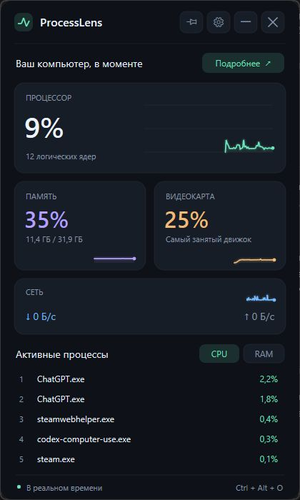

# ProcessLens

### Your PC, at a glance.

A native Windows system monitor with a compact desktop widget, live performance graphs, and a focused process explorer. Built with C++20, Win32, Direct2D, and DirectWrite.

[Download for Windows x64](https://github.com/TheYeldo/ProcessLens/releases/latest) · [Русский](README.ru.md) · [Build status](https://github.com/TheYeldo/ProcessLens/actions)

## What's new in 2.0

- A redesigned graphite interface: spacious metric cards, crisp typography, accent-colored graphs, hover states, and an original app icon.
- A 240 ms fade-and-slide entrance and 180 ms graph transitions. Windows reduced-motion preferences are respected; animations can also be disabled.
- Russian and English, switchable immediately. Russian is the default, including localized units, decimal separators, menus, settings, and confirmations.
- A settings panel: Mint / Ice / Iris accents, 70–100% opacity, animations, startup, click-through, and sampling interval.
- Freeze the current view to inspect a busy process list. Collection continues in the background; resume returns to the latest snapshot.
- System uptime, logical processor count, available memory, executable folder access, and copying a process path.
- Safer process actions: a held process handle and creation-time verification protect against PID reuse; critical Windows processes and ProcessLens itself cannot be ended here.
- A self-contained executable with the C++ runtime linked statically.

## Screenshots

Real Windows captures, with live operating-system counters.




## Features

CPU, memory, vendor-neutral GPU utilization, and network throughput update automatically. The expanded table supports sorting by name, PID, CPU, working set, and process I/O. Search works by name or PID; click a row for details. The mini-widget shows the top five processes, ranked by CPU or RAM.

The window is frameless, resizable, DPI-aware, and movable by its title bar. It can stay on top or allow clicks to pass through it. Closing hides it in the system tray. The tray menu also offers an explicit **Exit** command.

## Quick start

1. Download **ProcessLens.exe** from [Releases](https://github.com/TheYeldo/ProcessLens/releases/latest).
2. Keep it in a permanent folder and run it. No administrator rights or separate runtime installation are needed.
3. Press **Ctrl+Alt+O** to reveal the widget from another application.
4. Use **Expand / Mini widget**, or double-click the title bar, to change modes.
5. Open the gear button to choose language, accent, opacity, and refresh interval.

The first launch creates per-user Start Menu and Startup shortcuts pointing to the current executable. Startup launches ProcessLens hidden at sign-in so the global hotkey is available. Disable **Start with Windows** in settings or in the tray menu. If you move the executable, run it once from its new location to refresh the shortcuts.

If another application owns Ctrl+Alt+O, ProcessLens displays a message and remains accessible from the tray. The shortcut restores interaction even when click-through is enabled.

## Controls

| Control | Action |
|---|---|
| Ctrl+Alt+O | Reveal ProcessLens and restore interaction |
| Ctrl+F | Open expanded mode and focus search |
| Ctrl+A / Ctrl+V | Select all / paste in search |
| Space | Pause or resume the displayed snapshot, outside search |
| Ctrl+, | Open settings |
| Tab / Shift+Tab | Move between controls |
| Enter | Activate the focused control; never confirms termination |
| Up / Down | Select a process, outside search |
| Esc | Dismiss confirmation, settings, details, or search; then hide |
| Mouse wheel | Scroll the process table |
| Double-click title bar | Switch compact / expanded modes |

Ending a process always opens an in-app confirmation with **Cancel** and **End process**. No process is terminated automatically. Access failures and processes exiting while being inspected are handled without elevation.

## Architecture

```text
Windows APIs
     │
     ▼
MetricsCollector + GpuCollector
     │  background std::jthread · 250–2000 ms
     ▼
atomic shared_ptr<const MetricsSnapshot>
     │
     ▼
MainWindow: displayed snapshot + UI state
     │
     ├── cached sorted / filtered process list
     ├── pause, selection, process-handle checks
     └── short-lived animation timer
                    │
                    ▼
           Direct2D / DirectWrite
            widget + dashboard
```

Sampling never runs on the UI thread. Rendering and input share the same hit-target geometry. The displayed snapshot is held consistently during input and drawing. Process paths are cached by PID and creation time.

## Metrics collection

| Metric | Source | Calculation |
|---|---|---|
| System CPU | GetSystemTimes | Busy time / total elapsed CPU time |
| Process CPU | GetProcessTimes | Process-time delta / wall-time delta / logical processor count |
| Physical memory | GlobalMemoryStatusEx | Total, used, available, and percentage |
| Process memory | GetProcessMemoryInfo | Working set |
| GPU | PDH GPU Engine utilization counters | Sum process samples per physical engine, then take the busiest engine |
| Network | GetIfTable2 | Connected non-loopback adapter byte deltas / elapsed time |
| Process I/O | GetProcessIoCounters | Read/write transfer-byte deltas / elapsed time |
| Processes / threads | Tool Help snapshot | Executable name, PID, thread count |
| Executable path | QueryFullProcessImageNameW | Cached by process creation identity |
| System uptime | GetTickCount64 | Time since Windows started |

Process I/O includes transfers reported by Windows for the process; it is not a physical-disk utilization counter. GPU requires compatible Windows/WDDM counters and displays an unavailable state otherwise. The busiest-engine rule follows [Microsoft's description of Task Manager GPU metrics](https://devblogs.microsoft.com/directx/gpus-in-the-task-manager/).

Graphs retain 120 samples (about two minutes at the default 1-second interval). Network graphs scale to their recent peak. Transitions interpolate only the visual presentation; the process table and actions use collected values.

## Building

Requirements: Windows 10/11 x64, Visual Studio with **Desktop development with C++**, Windows SDK, and CMake 3.24+.

From a Developer PowerShell for Visual Studio:

```powershell
cmake -S . -B build -A x64
cmake --build build --config Release --parallel
ctest --test-dir build -C Release --output-on-failure
```

Output: **build\Release\ProcessLens.exe**. Visual Studio's bundled CMake can be used if it is not in PATH. The icon is checked in; rebuilding it is optional:

```powershell
.\tools\GenerateIcon.ps1
```

## Performance and settings

The default sampling interval is 1000 ms. Choose 250, 500, 1000, or 2000 ms in settings. 250 ms performs four times as many scans and increases CPU use.

A frame timer runs only while entrance or metric transitions are active. A hidden or minimized window does not animate; collection continues so reopening has recent history. Pausing freezes the view, not the collector.

Preferences are saved in **%LOCALAPPDATA%\ProcessLens\config.json**. Existing v1 settings are read with defaults for the new appearance fields. Window position and size are recovered onto an available monitor.

## Project structure

```text
include/processlens/  models, localization, UI state, calculations, APIs
src/                  Win32 window, collectors, renderer, formatting
resources/            manifest and executable version information
assets/               multi-resolution icon and application screenshots
tools/                reproducible icon generator
tests/                calculations, settings, interaction boundaries, GPU smoke test
.github/workflows/    Windows x64 build, tests, executable artifact
```

## Tests

Tests cover CPU deltas, per-process normalization, GPU aggregation, byte/rate/uptime formatting in both languages, graph buffers, process sorting and filtering, settings round-trip and v1 migration, invalid preference values, scroll boundaries, easing endpoints, and hit-test boundaries.

A live GPU smoke test accepts either a valid percentage or unavailable counters on a headless runner. It does not substitute for deterministic aggregation tests. GitHub Actions builds and tests on windows-2022.

## Known limitations

- The executable is not digitally signed.
- GPU temperatures, fan speeds, and per-process GPU values are not collected.
- Restricted processes may expose only basic inventory information.
- Custom-drawn controls support keyboard navigation but do not yet provide a full screen-reader accessibility tree.
- Extremely small available desktop areas can constrain the dashboard; the compact widget is intended for smaller workspaces.

## License

[MIT](LICENSE).
