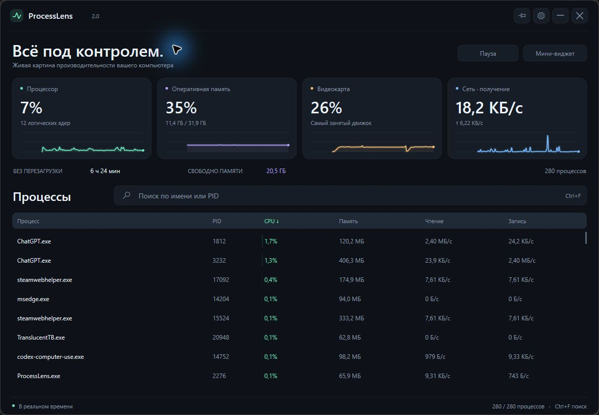

# ProcessLens 2.0

Нативный монитор Windows 10/11 на C++20. Показывает реальные CPU, память, GPU, сеть и процессы в компактном виджете или подробном окне.

[Скачать для Windows x64](https://github.com/TheYeldo/ProcessLens/releases/latest) · [English](README.md)

## Что нового

- Новый графитовый интерфейс с крупными показателями, цветными графиками и собственной иконкой.
- Плавное появление окна за 240 мс и переходы графиков за 180 мс. Учитывается системное отключение анимаций.
- Русский язык по умолчанию; английский можно включить в настройках без перезапуска.
- Цвета акцента «Мята», «Лёд», «Ирис», непрозрачность 70–100%, настройка анимаций и автозапуска.
- Пауза просмотра, время работы системы, число логических ядер, открытие папки процесса и копирование пути.
- Сортировка, поиск по имени или PID, подробности процесса и подтверждение завершения.



## Как пользоваться

Скачайте ProcessLens.exe, сохраните в постоянной папке и запустите. Права администратора и отдельная установка Visual C++ Runtime не нужны.

**Ctrl+Alt+O** открывает виджет поверх текущего приложения и возвращает управление, если включён пропуск кликов. Кнопка «Подробнее / Мини-виджет» или двойной щелчок по заголовку переключает режим.

**Ctrl+F** — поиск; **Пробел** вне поиска — пауза просмотра; **Ctrl+,** — настройки. **Esc** закрывает подтверждение, настройки, подробности или очищает поиск; затем скрывает окно. **Tab / Shift+Tab** перемещают фокус, **Enter** активирует элемент, но не подтверждает завершение процесса.

Закрытие окна скрывает его в трей. Для полного выхода выберите «Выйти» в меню значка. При первом запуске создаются ярлыки меню «Пуск» и автозапуска текущего пользователя. Можно отключить «Запуск вместе с Windows» в настройках. После переноса exe запустите его из новой папки, чтобы обновить ярлыки.

## Настройки и данные

Настройки сохраняются в `%LOCALAPPDATA%\ProcessLens\config.json`. Частота обновления: 250, 500, 1000 или 2000 мс. По умолчанию — 1000 мс. Интервал 250 мс повышает нагрузку на CPU.

Пауза фиксирует отображаемый снимок: сбор данных продолжается, а после возобновления показываются свежие значения. Графики хранят 120 отсчётов. Показатели берутся из Windows API; температуры и обороты вентиляторов не имитируются. Недоступные счётчики обозначаются прочерком.

Кнопка «Завершить процесс» требует отдельного подтверждения. Программа проверяет время создания процесса и сохраняет его handle, чтобы повторное использование PID не привело к завершению другого приложения. Критические процессы Windows и сама ProcessLens защищены от завершения через эту кнопку.

## Сборка

Нужны Windows x64, Visual Studio с компонентами разработки C++, Windows SDK и CMake 3.24+.

```powershell
cmake -S . -B build -A x64
cmake --build build --config Release --parallel
ctest --test-dir build -C Release --output-on-failure
```

Результат: `build\Release\ProcessLens.exe`. Архитектура, источники метрик и ограничения описаны в [английском README](README.md). Исполняемый файл не подписан цифровым сертификатом. Лицензия — [MIT](LICENSE).
